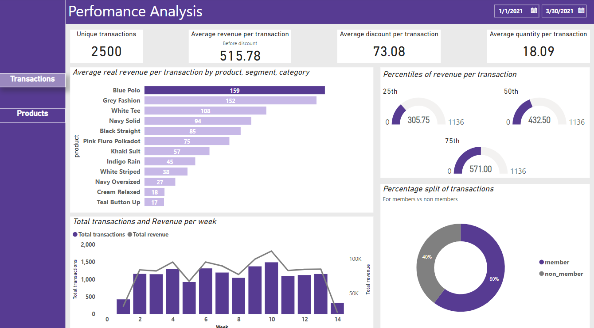
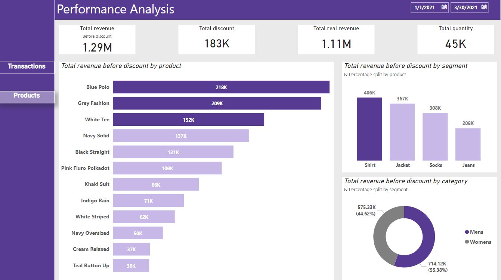

# Dashboard 

Link: https://app.powerbi.com/groups/me/reports/f1913254-bbc8-4cac-8b0c-1635188cdc17/ReportSection?experience=power-bi

## Overview 
In this analytics project, our objective was to answer the following questions: 

### High-Level Analysis
* What was the total quantity sold for all products?
* What is the total generated revenue for all products before discounts?
* What was the total discount amount for all products?

### Transaction Analysis
* How many unique transactions were there?
* What is the average unique products purchased in each transaction?
* What are the 25th, 50th and 75th percentile values for the revenue per transaction?
* What is the average discount value per transaction?
* What is the percentage split of all transactions for members vs non-members?
* What is the average revenue for member transactions and non-member 

### Product Analysis
* What are the top 3 products by total revenue before discount?
* What is the total quantity, revenue and discount for each segment?
* What is the top selling product for each segment?
* What is the total quantity, revenue and discount for each category?
* What is the top selling product for each category?
* What is the percentage split of revenue by product for each segment?
* What is the percentage split of revenue by segment for each category?
* What is the percentage split of total revenue by category?

